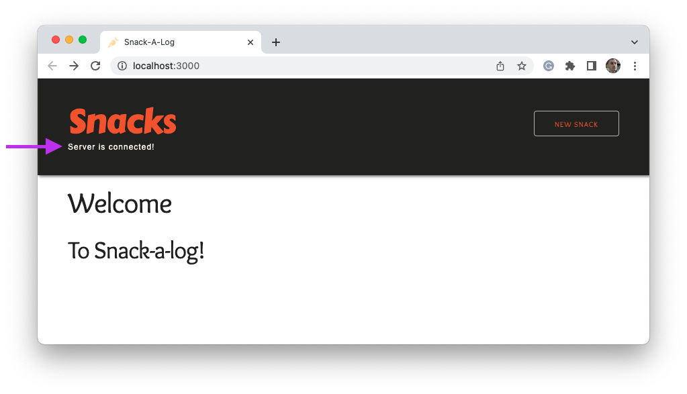

# Snack-a-Log Project

For this assignment, you will build out the back-end for an application that collects information about different snacks. Users can view information about snacks, create new snacks to add to the database, as well as edit existing snacks.

19 features need to be created. Each completed feature is worth 1 point. A minimum of 14 points must be attained to pass this project. You may receive partial credit (0.5 points) for code that is close to passing the tests but does not pass all the tests.

## Project setup

To get the project up and running, you will need to complete the following steps:

1. Fork and clone this repository.

1. Run `npm install` from the root directory.

1. Run the following command:

   ```
   npm run install:all
   ```

1. Create two new databases on your machine with the following names: `snack_a_log_dev` and `snack_a_log_test`.

1. In the `back-end/` directory, create a `.env` file with the following contents:

   ```
   PORT=5001
   DATABASE_URL=postgres://postgres@localhost:5432/snack_a_log_dev
   TEST_DATABASE_URL=postgres://postgres@localhost:5432/snack_a_log_test
   ```

1. In the `front-end/` directory, create a `.env` file with the following contents:

   ````
   REACT_APP_API_URL=http://localhost:5001   ```
   ````

### Running the application

To run the front end, you can navigate to the `front-end/` directory and run the `npm start` command. To run the back end, you can navigate to the `back-end/` directory and run the `npm start` command. On the back end, you may also use the `npm run dev` command to run the server using the Nodemon package.

Alternatively, you can run the `npm start` command from the root directory to run both the front end and the back end.

## Resources

You will be creating CRUD routes for two different resources: snacks and reviews. Each snack is a representation of a healthy or unhealthy snack. Each review represents a single person's review of a snack.

Snacks have many reviews while a review has only one snack.

## Server response formats

Your responses should follow the [JSend](https://github.com/omniti-labs/jsend) specification as best as possible. This means the following:

- Each response from the server should include a `"status"` key which is set to either `"success"`, `"fail"`, or `"error"`.

  - `"success"` is used whenever the request is formatted correctly and the server can respond appropriately.
  - `"fail"` is used when something is wrong with the request, such as an incorrectly formatted route.
  - `"error"` is used when something goes wrong with the server, such as a database connection failure.

- Each response should have a `"data"` key which is an object.

- The value of the `"data"` key is an object with a key that represents the name of the resource, appropriately pluralized.

### Examples

The following is an example response for requesting all snacks. Notice how the key inside of the `"data"` object is the plural form of the resource.

```json
{
  "data": {
    "snacks": [
      {
        "added_sugar": 1,
        "created_at": "2022-06-02T20:55:30.712Z",
        "fiber": 3,
        "id": 51,
        "image": "https://dummyimage.com/400x400/6e6c6e/e9e9f5.png&text=No+Image",
        "is_healthy": false,
        "name": "Potato Chips",
        "protein": 1,
        "updated_at": "2022-06-02T20:55:30.712Z"
      },
      {
        "added_sugar": 19,
        "created_at": "2022-06-02T20:47:05.387Z",
        "fiber": 4,
        "id": 6,
        "image": "https://content.nutrisystem.com/images/products/alc/large/BirthdayCakeSquare_L.jpg",
        "is_healthy": false,
        "name": "Healthy Birthday Cake Square",
        "protein": 8,
        "updated_at": "2022-06-02T20:47:05.387Z"
      }
    ]
  },
  "status": "success"
}
```

The following is an example response for requesting a single review. Notice how the key inside of the `"data"` object is the singular form of the resource.

```json
{
  "data": {
    "review": {
      "content": "Sint ea reprehenderit cupidatat sunt eu nisi aute id commodo anim magna et fugiat.",
      "created_at": "2022-06-03T18:18:00.904Z",
      "id": 3,
      "rating": 4,
      "reviewer_name": "Kayla",
      "snack_id": 1,
      "updated_at": "2022-06-03T18:18:00.904Z"
    }
  },
  "status": "success"
}
```

The following is an example response for requesting a single review that does not exist. Notice how the `"status"` value is `"fail"` and that the `"data"` key points towards a string value.

```json
{
  "data": "No resource found with ID of '999'",
  "status": "fail"
}
```

## Instructions

To complete this project, you must complete the following for the back-end. While the following order of features makes sense, you should feel free to complete features in the order that works best for you.

### 1. Connect the front-end and back-end applications

Install the `cors` package and use it so that the back-end and front-end applications can communicate. You should see the following text show up on the front end when the back end and front end can communicate.



### 2. Add a catch-all route

Create a catch-all route that responds with the 404 status code whenever a request is made for a route that doesn't exist. Make sure to include the `"data"` and `"status"` keys as part of your response body. Your `"status"` key value should be `"fail"`.

#### Example

Creating a `GET` request to `/incorrect/route` should return the following response.

```json
{
  "data": "GET /incorrect/route not found.",
  "status": "fail"
}
```

### 3. Add an error handler

Create an error handler that responds whenever an internal server error arises. Make sure to include the `"data"` and `"status"` keys as part of your response body. Your `"status"` key value should be `"error"`.

#### Example

If the database was not accessible, you may want to respond with the following error.

```json
{
  "message": "connection refused",
  "status": "error"
}
```

### 4. Implement `knex` configuration

Install the `knex` library and create a `knexfile.js` with the appropriate configuration. Then, create a `db/` directory and create a file where you can export your database connection.

### 5. Create your MVC file structure

Create a `controllers/` and `models/` folder. Inside each folder, create an appropriate file for both the snack and reviews resource. You should end up with files and folders that look like the ones below.

```
controllers
├── reviews.controller.js
└── snacks.controller.js

models
├── review.model.js
└── snack.model.js
```

### 6. Create your snacks table

Use `knex` migrations to create your snacks table. Each snack has the following properties in addition to a **primary key**.

- **name:** text
- **image:** text
- **fiber:** integer
- **protein:** integer
- **added_sugar:** integer
- **is_healthy:** boolean

Once you have finished, run the migration. Ensure your migration can be rolled back and forwards without failing.

### 7. Create your snack seeds

Create a seed file for your snacks. You may use the data in the [`example-data.md`](./example-data.md) for your seeds or create your own.

Once you have finished, run your seed file. Ensure that your seed file can be run multiple times without failing.

### 8. Create your reviews table

Use `knex` migrations to create your reviews table. Each review has the following properties in addition to a **primary key**.

- **reviewer_name:** string
- **content:** text
- **rating:** integer
- **snack_id:** foreign key

Once you have finished, run the migration.

### 9. Create your review seeds

Create a seed file for your reviews. You may use the data in the [`example-data.md`](./example-data.md) for your seeds or create your own.

Once you have finished, run your seed file. Ensure that your seed file can be run multiple times without failing.

### 10. Create your snack CRUD routes

Create the following routes for your snacks resource.

| Method   | Path          | Action                 |
| -------- | ------------- | ---------------------- |
| `GET`    | `/snacks`     | Get all snacks         |
| `GET`    | `/snacks/:id` | Get a single snack     |
| `POST`   | `/snacks`     | Create a single snack  |
| `PUT`    | `/snacks/:id` | Update a single snacks |
| `DELETE` | `/snacks/:id` | Destroy a single snack |

### 11. Create your review CRUD routes

Create the following routes for your reviews resource.

| Method   | Path           | Action                  |
| -------- | -------------- | ----------------------- |
| `GET`    | `/reviews`     | Get all reviews         |
| `GET`    | `/reviews/:id` | Get a single review     |
| `POST`   | `/reviews`     | Create a single review  |
| `PUT`    | `/reviews/:id` | Update a single reviews |
| `DELETE` | `/reviews/:id` | Destroy a single review |

### 12. Determine the healthiness of snacks

Instead of allowing the user to define whether or not a snack is healthy, your server should decide. For a snack to be healthy, it should meet the following criteria:

- Its `protein` value should be equal to or greater than 5.
- Its `fiber` value should be equal to or greater than 5.
- Its `added_sugar` value should be less than 5.

Automatically set the `is_healthy` value on created and updated snacks.

### 13. Reformat snack names

Format incoming snack names so that they are properly formatted. For each word in the snack name (i.e., each collection of characters separated by a space), capitalize the first letter of the word and lowercase all other letters as long as the word length is greater than 2.

#### Examples

The following are examples of how the name formatting should work.

```
PRETZELS -> Pretzels
celery sticks -> Celery Sticks
FLAMIN' hot cheetos -> Flamin' Hot Cheetos
ants on a log -> Ants on a Log
```

### 14. Set default values for snack resources

Implement the defaults below for various snack values. These values should be assigned on newly created snacks as well as updated snacks.

| Field         | Default value                                                      |
| ------------- | ------------------------------------------------------------------ |
| `protein`     | `0`                                                                |
| `fiber`       | `0`                                                                |
| `added_sugar` | `0`                                                                |
| `is_healthy`  | `false`                                                            |
| `image`       | `"https://dummyimage.com/400x400/6e6c6e/e9e9f5.png&text=No+Image"` |

### 15. Set default values for review resources

If a review's name is not set or is an empty string (i.e., `""`), set it to the value `"Anonymous"`.

This should work for newly created reviews as well as reviews updated in an attempt to remove the name.

### 16. Implement failure conditions for snack CRUD routes

Implement the following errors for the routes you've created for the snacks resource. For each of the following situations, your response body should include a `"status"` key with the value `"fail"`.

| Situation                                                | Example                 | Example request body  | Error status code |
| -------------------------------------------------------- | ----------------------- | --------------------- | ----------------- |
| A request is made for a non-existent snack.              | `GET /snacks/999999`    | N/A                   | 404               |
| A request is made to create a snack with a missing name. | `POST /snacks`          | `{ added_sugar: 10 }` | 422               |
| A request is made to update a non-existent snack.        | `PUT /snacks/999999`    | N/A                   | 404               |
| A request is made to update a snack with a missing name. | `PUT /snacks/999999`    | `{ added_sugar: 10 }` | 422               |
| A request is made to delete a snack that does not exist. | `DELETE /snacks/999999` | N/A                   | 404               |

### 17. Implement failure conditions for review CRUD routes

Implement the following errors for the routes you've created for the reviews resource. For each of the following situations, your response body should include a `"status"` key with the value `"fail"`.

| Situation                                                                                   | Example                  | Example request body        | Error status code |
| ------------------------------------------------------------------------------------------- | ------------------------ | --------------------------- | ----------------- |
| A request is made for a non-existent review.                                                | `GET /reviews/999999999` | N/A                         | 404               |
| A request is made to create a review where the rating value is below 0.                     | `POST /reviews`          | `{ rating: -1, ... }`       | 422               |
| A request is made to create a review where the rating value is above 5.                     | `POST /reviews`          | `{ rating: 99, ... }`       | 422               |
| A request is made to create a review where the `snack_id` is empty.                         | `POST /reviews`          | `{ snack_id: null, ... }`   | 422               |
| A request is made to create a review where the `snack_id` does not match an existing snack. | `POST /reviews`          | `{ snack_id: 999999, ... }` | 404               |
| A request is made to update a review where the rating value is below 0.                     | `PUT /reviews/:id`       | `{ rating: -1, ... }`       | 422               |
| A request is made to update a review where the rating value is above 5.                     | `PUT /reviews/:id`       | `{ rating: 99, ... }`       | 422               |
| A request is made to update a review where the `snack_id` is empty.                         | `PUT /reviews/:id`       | `{ snack_id: null, ... }`   | 422               |
| A request is made to update a review where the `snack_id` does not match an existing snack. | `PUT /reviews/:id`       | `{ snack_id: 999999, ... }` | 404               |
| A request is made to delete a review that does not exist.                                   | `DELETE /reviews/999999` | N/A                         | 404               |

### 18. Create a `GET /snacks/:id/reviews` route

Create a new `GET` route with the path of `/snacks/:id/reviews`. This path should return the snack with a `reviews` key. The value of the `reviews` key should be an array of all reviews associated with that snack. If there are no reviews associated with that snack, it should be an empty array.

#### Example

Creating a `GET` request to `/snacks/4/reviews` should return the following response.

```json
{
  "data": {
    "snack": {
      "added_sugar": 9,
      "created_at": "2022-06-03T18:18:00.898Z",
      "fiber": 11,
      "id": 4,
      "image": "https://picsum.photos/id/139/300/300",
      "is_healthy": true,
      "name": "New Wave Nuts",
      "protein": 55,
      "reviews": [
        {
          "content": "Culpa quis incididunt enim laboris cupidatat anim voluptate non consectetur veniam eiusmod.",
          "created_at": "2022-06-03T18:18:00.904Z",
          "id": 11,
          "rating": 3,
          "reviewer_name": "Eli",
          "snack_id": 4,
          "updated_at": "2022-06-03T18:18:00.904Z"
        }
      ],
      "updated_at": "2022-06-03T18:18:00.898Z"
    }
  },
  "status": "success"
}
```

### 19. Deploy your application

Deploy your full-stack application
